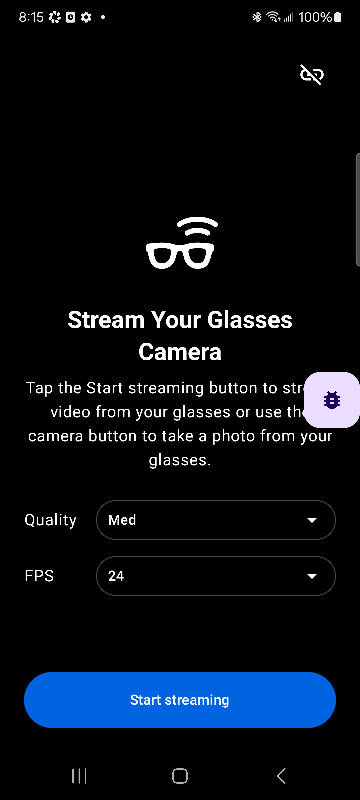
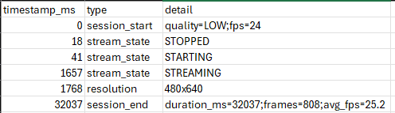
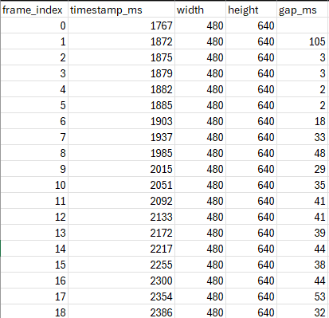

# Progress log

## July 13, 2026
Got the CameraAccess sample building and running on my S21 with the mock device.
The stream crashed as soon as it started. Dug into it with adb logcat and found a
mul-overflow in Android's software VP8 encoder. The back
camera resolution is too big and overflows it. Switched the mock camera source to
the front camera and it streams fine. So it's a codec limit.

## July 14, 2026
Quality and frame rate were hardcoded at addStream(), so I added Quality
(Low/Med/High) and FPS (2/7/15/24/30) buttons to the stream screen, using the
SDK's supported values.

Hit two bugs:
1. Changing settings mid-stream raced the SDK and the new stream stopped right
   after starting. Fixed it by waiting for the old stream to reach STOPPED before
   adding the new one.
2. High quality (720x1280) can crash the software VP8 encoder on my S21, same as
   the back camera. Low and Med are fine. Should be OK on the real glasses since
   they encode in hardware.

Also logged the frame resolution when it changes, which is the start of the
metrics work.

Same scene at Low/24 FPS and High/30 FPS:

 

## July 15, 2026
The mid-stream quality change was laggy, so I moved the Quality and FPS controls
off the stream screen onto the setup screen as dropdowns, so you pick before
streaming starts. That removed the reconfigure code and the lag.

The app kept crashing a few seconds into streaming. Turned out to be Android
Studio's device mirroring running its own VP8 encoder that fought the stream's
encoder and crashed the shared codec. Disabled mirroring and it's stable.

Built the metrics layer. A SessionLogger writes two CSVs per session:
frames_<time>.csv (one row per frame with timestamp, size, and gap, for FPS and
jitter) and events_<time>.csv (session start/end, state changes, resolution
changes, errors, plus duration and average FPS at the end).

Quality and FPS as dropdowns on the setup screen:

## July 16, 2026
Opened a mock session CSV and checked the numbers. Effective FPS came out below
the requested rate, and the gap_ms column captures the jitter. On the mock the
resolution stays fixed at 480x640 no matter which quality I pick, since the mock
does not rescale its camera.

The events file (session summary) and the frames file (per-frame timing):

## July 17, 2026
Wrote the README: requirements, GitHub token setup, Developer Mode, build and run,
mock steps, the CSV columns, how to export the logs, and known limitations (the
back camera / High quality encoder crash, and turning off Android Studio Device
Mirroring to stop a mid-stream crash).
