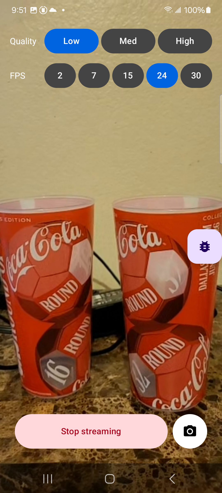
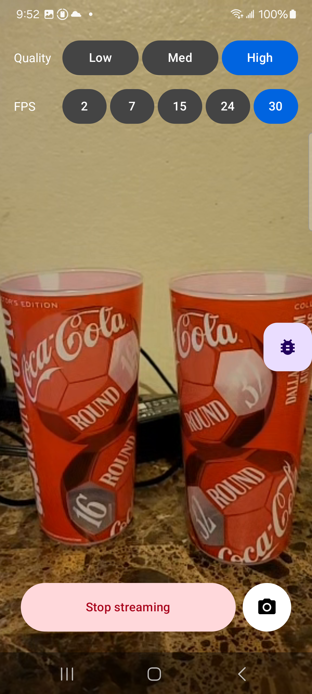

# Progress log

## July 13, 2026
Got the CameraAccess sample building and running on my S21 with the mock device.
The stream crashed as soon as it started. Dug into it with adb logcat and found a
mul-overflow in Android's software VP8 encoder (vp8_pick_frame_size). The back
camera resolution is too big and overflows it. Switched the mock camera source to
the front camera and it streams fine. So it's a codec limit.

## July 14, 2026
Quality and frame rate were hardcoded at addStream(), so I added Quality
(Low/Med/High) and FPS (2/7/15/24/30) buttons to the stream screen, using the
SDK's supported values.

Hit two bugs:
1. Changing settings mid-stream raced the SDK and the new stream stopped right
   after starting. Fixed it by waiting for the old stream to reach STOPPED before
   adding the new one.
2. High quality (720x1280) can crash the software VP8 encoder on my S21, same as
   the back camera. Low and Med are fine. Should be OK on the real glasses since
   they encode in hardware.

Also logged the frame resolution when it changes, which is the start of the
metrics work.

Same scene at Low/24 FPS and High/30 FPS:

