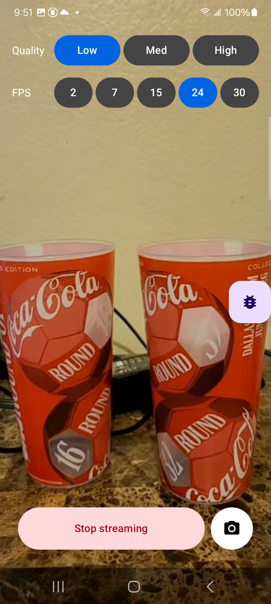
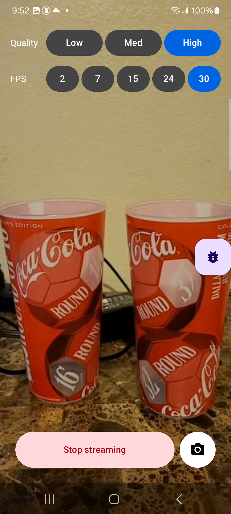
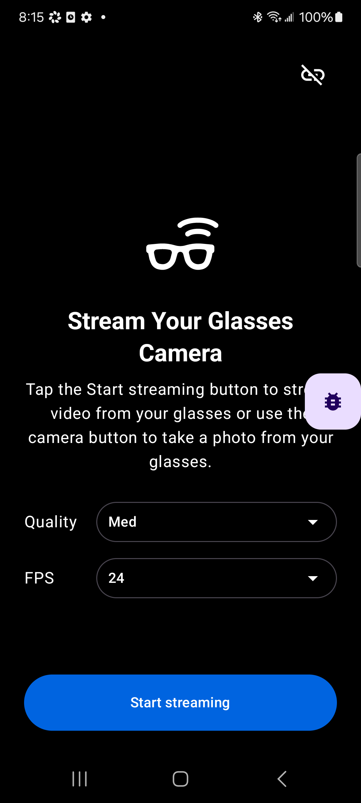
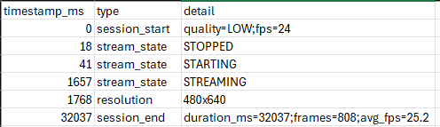
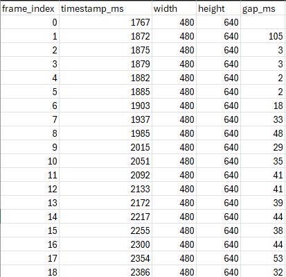

# Progress log

## July 13, 2026
Got the CameraAccess sample building and running on my S21 with the mock device.
The stream crashed as soon as it started. Dug into it with adb logcat and found a
mul-overflow in Android's software VP8 encoder. The back
camera resolution is too big and overflows it. Switched the mock camera source to
the front camera and it streams fine. So it's a codec limit.

## July 14, 2026
Quality and frame rate were hardcoded at addStream(), so I added Quality
(Low/Med/High) and FPS (2/7/15/24/30) buttons to the stream screen, using the
SDK's supported values.

Hit two bugs:
1. Changing settings mid-stream raced the SDK and the new stream stopped right
   after starting. Fixed it by waiting for the old stream to reach STOPPED before
   adding the new one.
2. High quality (720x1280) can crash the software VP8 encoder on my S21, same as
   the back camera. Low and Med are fine. Should be OK on the real glasses since
   they encode in hardware.

Also logged the frame resolution when it changes, which is the start of the
metrics work.

Same scene at Low/24 FPS and High/30 FPS:

 

## July 15, 2026
The mid-stream quality change was laggy, so I moved the Quality and FPS controls
off the stream screen onto the setup screen as dropdowns, so you pick before
streaming starts. That removed the reconfigure code and the lag.

The app kept crashing a few seconds into streaming. Turned out to be Android
Studio's device mirroring running its own VP8 encoder that fought the stream's
encoder and crashed the shared codec. Disabled mirroring and it's stable.

Built the metrics layer. A SessionLogger writes two CSVs per session:
frames_<time>.csv (one row per frame with timestamp, size, and gap, for FPS and
jitter) and events_<time>.csv (session start/end, state changes, resolution
changes, errors, plus duration and average FPS at the end).

Quality and FPS as dropdowns on the setup screen:

## July 16, 2026
Opened a mock session CSV and checked the numbers. Effective FPS came out below
the requested rate, and the gap_ms column captures the jitter. On the mock the
resolution stays fixed at 480x640 no matter which quality I pick, since the mock
does not rescale its camera.

The events file (session summary) and the frames file (per-frame timing):

## July 17, 2026
Wrote the README: requirements, GitHub token setup, Developer Mode, build and run,
mock steps, the CSV columns, how to export the logs, and known limitations (the
back camera / High quality encoder crash, and turning off Android Studio Device
Mirroring to stop a mid-stream crash).

## July 30, 2026
Went through the lab's updated metrics list and testing guide to work out what
the logger needs to record next. Split the metrics into what the toolkit can
reach directly and what would need a phone-side encoder and a media server
first, since the toolkit only hands the app decoded frames.

Also wrote up my findings on where the video encoder sits on each glasses
platform. Short version: it is on the glasses in every case. Raw video at the
stream's resolution is about 130 Mbps and Bluetooth Classic carries about
2 Mbps, so the frames have to be compressed before they leave the glasses.

## July 31, 2026
Started the logger update with the trial metadata. The setup screen gained
Device / Position / Motion / Network limit dropdowns next to Quality and FPS,
and every session now appends one row to a shared trials.csv with the run's
conditions, an auto-generated trial ID (0001, 0002, counter survives app
restarts), and an epoch_start_ms wall-clock anchor. The session's frames and
events files stay separate; session_stamp in the trial row is the join key.

Two clocks on purpose: frame and event timestamps stay on the monotonic clock
so gaps cannot be corrupted by clock adjustments, and the epoch anchor pins the
session to wall time so these logs can be lined up with packet captures and
viewer recordings taken during the same run.

The Device and Network limit dropdowns are metadata, not controls: the dropdown
records which platform and throttle condition the trial ran under so the CSVs
are self-describing. Mock sessions are labeled mock_loopback instead of
pretending to be Bluetooth. Also made the setup screen scrollable so the new
controls do not hide behind the start button.

Added tools/merge_sessions.py: reads every session's CSVs and builds two master
tables, trials_all.csv (one row per session) and windows_all.csv (one row per
second across all sessions, with the trial conditions stamped onto every row).

Builds clean. Next: verify on the mock, then startup/retry/recovery tracking.

## August 3, 2026
Added the recovery tracking. The state collector now writes five new event
types into events.csv: startup (time to first STREAMING plus how many attempts
it took), retry (a repeated STARTING with the gap since the previous try),
failure (the stream fell out of STREAMING on its own), recovery (how long it
took STREAMING to come back), and abort (the session ended abnormally, either
a terminal state or a critical SDK error).

The part I like: a user pressing Stop can never show up as a failure, and it
needs no flag to work. stopStream() cancels the state collector before it
touches the stream, so by the time teardown causes state changes nothing is
listening. Every transition the tracker sees is the stream's own behavior.

Durations come from the same monotonic session clock as everything else, so
recovery times cannot be corrupted by wall clock adjustments. Tested on the
mock by toggling the mock device's power off mid-stream, which produces the
failure and abort events, while normal sessions stay clean.

## August 4, 2026
Added the display-side logging. The presentation queue's onFrameReady callback
now writes display_<time>.csv, one row per frame that actually reached the
screen. The display clock differs from the arrival clock by the presentation
buffer, so this is the local viewer's view of the stream: comparing the two
files for the same frame (joined on the pts column) shows what the buffer
really did, and display gaps over 500 ms are the freeze definition.

Also logged the sender-side pts per frame in frames.csv and phone battery at
session start and end, and upgraded the merge tool: windows_all.csv now carries
viewer fps, gaps, and freeze counts per second next to the input columns, and
trials_all.csv folds the recovery events into per-session columns (startup
time, attempts, retries, failures, recoveries, abort flag, battery drain).

The full set per session is now trials.csv (one shared row), frames (arrival),
display (screen), events (the story). One merge command turns any folder of
sessions into the two master tables.
